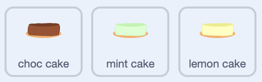

## Challenge - make different flavours

You've built a full cake decorator. For a challenge, can you let the player switch between different **flavours** of cake — like chocolate, mint, and lemon — each a different colour?

--- challenge ---

--- task ---

Can you add a flavour button that changes the cake's colour, and make sure your toppings still stamp on every flavour?

Here's one way to do it. Work through a bit at a time and test as you go.

--- /task ---

--- /challenge ---

--- collapse ---
---
title: Make the flavour cakes
---

**Duplicate** your `cake` sprite once for each new flavour, and rename the copies, like `mint cake` and `lemon cake`.

In the **Costumes** tab of each copy, recolour the cakes to match the flavour — yellow for lemon, green for mint.



--- /collapse ---

--- collapse ---
---
title: Make a flavour chooser
---

Create two variables, `counter` and `icing colour`, and **untick** both to hide them.

**Duplicate** a chooser button for the flavours. Set it up to start on chocolate and sit at the top of the stage.


```blocks3
when green flag clicked
set [counter v] to (0)
set [icing colour v] to [choc]
go to x: (166) y: (152)
```

When it's clicked, broadcast `icing` with the usual press animation.

```blocks3
when this sprite clicked
broadcast (icing v)
change y by (1)
play sound (Crank v) until done
change y by (-1)
```

Each click should move to the next flavour. Use the `counter` to step through choc, mint, and lemon.

```blocks3
when I receive (icing v)
change [counter v] by (1)
if <(counter) = (3)> then
set [counter v] to (0)
end
if <(counter) = (0)> then
set [icing colour v] to [choc]
end
if <(counter) = (1)> then
set [icing colour v] to [mint]
end
if <(counter) = (2)> then
set [icing colour v] to [lemon]
end
```

--- /collapse ---

--- collapse ---
---
title: Make each cake respond to its flavour
---

On each flavour cake, add scripts so it only stamps when its flavour is chosen. This is the `mint cake` version — change `mint` to match each cake.

```blocks3
when I receive (icing v)
switch costume to (layer type)
if <(icing colour) = [mint]> then
erase all
go to x: (0) y: (0)
stamp
end
```

```blocks3
when I receive (layer v)
switch costume to (layer type)
if <(icing colour) = [mint]> then
next costume
erase all
go to x: (0) y: (0)
stamp
set [layer type v] to (costume [number v])
end
```

--- /collapse ---

--- collapse ---
---
title: Stamp toppings on every flavour
---

Your `toppings` sprite only checks for the first cake's colour. In its stamping script, copy the `if touching color`{:class="block3sensing"} block and add one for each flavour's colour, so toppings stamp on chocolate, mint, and lemon cakes.

--- /collapse ---

**Test:** Click the green flag and switch flavours. You can now decorate any of them!

--- save ---
