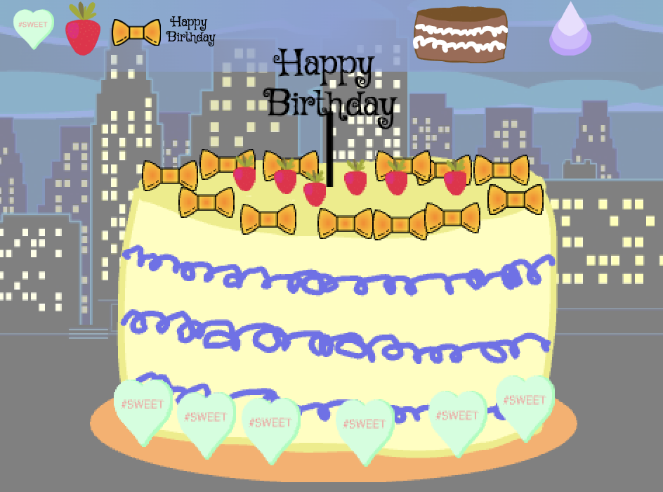

## What you will make

Make your own **cake-decorating simulator**! You will design a cake, then click toppings and icing to decorate it however you like.

You will:
- stamp toppings onto a cake
- make buttons to choose different decorations
- add different cake types and flavours
- show nice comments as you decorate

--- print-only ---

--- /print-only ---

--- no-print ---

Try out the finished project. Click the toppings and icing to decorate the cake. Turn your sound on!

 <iframe allowtransparency="true" width="485" height="402" src="https://scratch.mit.edu/projects/embed/1362331451/?autostart=false" frameborder="0"></iframe>

--- /no-print ---

### You will need:
- the Scratch editor
- some cake and topping pictures (you can draw your own or use the ones in Scratch)
