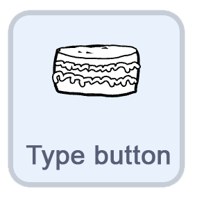
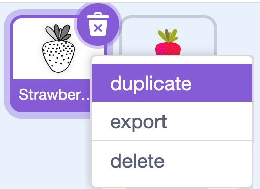

## More cakes

In this step, you'll let players switch between different **cake types**, like layered, wedding, or cupcake.

{:width="150px"}

> [!TASK]
>
> Start by making a new button. 
>
> **Duplicate** one of your button sprites.
>
> {:width="250px"}

> [!TASK]
>
> In the costume tab. Change its costume to make a small cake symbol.
>
> {:width="450px"}

> [!TASK]
>
> Move the button to the top of the stage, and change the x and y.
>
> ```blocks3
> when green flag clicked
> go to x: (91) y: (149)
> ```

> [!TASK]
>
> Change the broadcast to **cake type**.
>
> ```blocks3
> when this sprite clicked
> +broadcast (cake type v)
> change y by (1)
> play sound (Crank v) until done
> change y by (-1)
> ```

Next, make different types of cakes with new costumes.

> [!TASK]
>
> Select the **cake** sprite.
>
> {:width="150px"}

> [!TASK]
>
> In the **Costumes tab**, **duplicate** your first costume and use the paint tools to make a different cake. The example shows a layered cake. 
>
> {:width="450px"}

> [!TIP]
>
> Duplicating the costume keeps the colour of the cake the same so your toppings still stamp.

> [!TASK]
>
> Create a `variable`{:class="block3variables"} and name it **cake type**. This will remember which cake is showing.
>
> {:width="450px"}

> [!TASK]
>
> Set `cake type`{:class="block3variables"} to `1` at the start of the green flag block.
>
> ```blocks3
> when green flag clicked
> +set [cake type v] to (1)
> erase all
> go to x: (0) y: (-100)
> hide
> stamp
> ```

> [!TASK]
>
> Add a `when I receive`{:class="block3events"} block and choose the **cake type** message. Add the `next costume`{:class="block3looks"} so that it erases the current costume then stamps to the next.
>
> ```blocks3
> when I receive (cake type v)
> erase all
> next costume
> stamp
> ```

**Test:** Click the green flag, then click your cake type button. Check that the cake changes to the next one each time.

{:width="450px"}

> [!SAVE]
