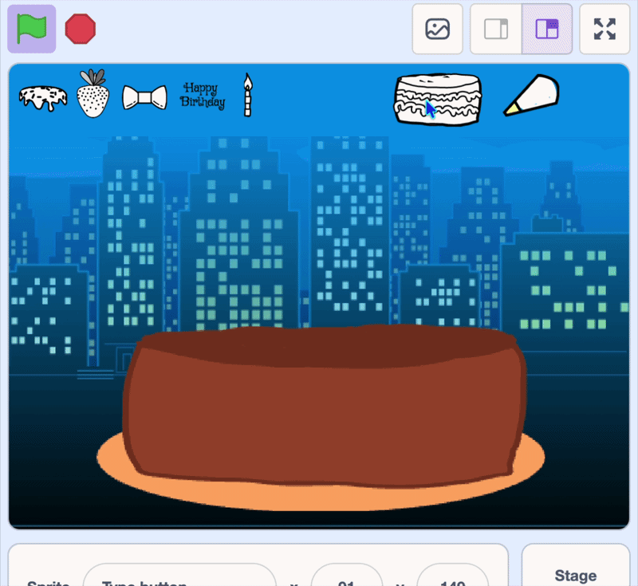

## Challenge: more cakes
--- challenge ---

For a challenge, you can let players switch between different **cake types** — layered, wedding or cupcakes! 

--- /challenge ---

--- task ---

Start by making a new button. 

**Duplicate** one of your button sprites and change its costume to make a small cake symbol.

--- /task ---

--- task ---

Move the button to the top of the stage, and change the x and y.

```blocks3
when green flag clicked
go to x: (91) y: (149)
```

--- /task ---

--- task ---

Change the broadcast to `type`.

```blocks3
when this sprite clicked
+broadcast (type v)
change y by (1)
play sound (Crank v) until done
change y by (-1)
```

--- /task ---

--- task ---

Next, give the cake a new costume for each type of cake.

Select the **cake** sprite.


In the **Costumes tab**, **duplicate** your cake costume and change it into different cakes. 

**Tip:** Duplicating the costume keeps the colour of the cake the same so your toppings still stamp.


--- /task ---

--- task ---

Create a variable called `cake type`{:class="block3variables"} to remember which cake is showing.
--- /task ---

--- task ---

On the **cake** sprite, set `cake type`{:class="block3variables"} to `1` at the start of its green-flag blocks.

```blocks3
when green flag clicked
+set [cake type v] to (1)
hide
go to x: (0) y: (0)
stamp
```

--- /task ---

--- task ---

Add blocks so that when the cake receives the `type` message, it switches to the next costume and stamps it.

```blocks3
when I receive (type v)
switch costume to (cake type)
erase all
next costume
go to x: (0) y: (0)
stamp
set [cake type v] to (costume [number v])
```

**Tip:** Each time the button is clicked, the cake clears the stage, switches to the next cake, and stamps it — so a different cake shows each time.

--- /task ---

**Test:** Click the green flag, then click your cake type button. Check that the cake changes to the next one each time.



--- save ---