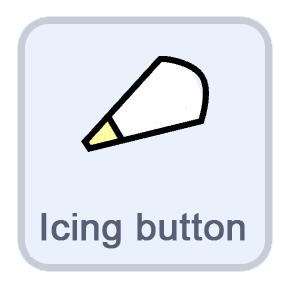
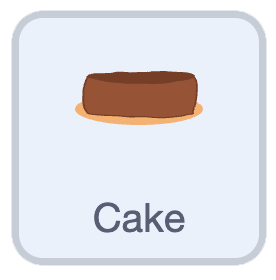
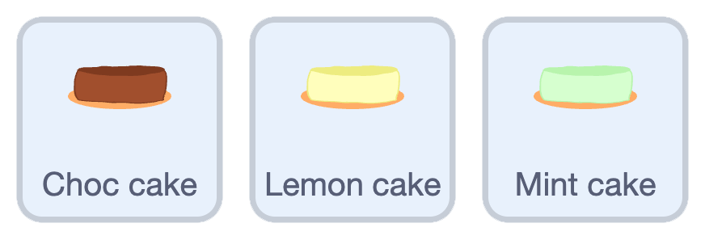
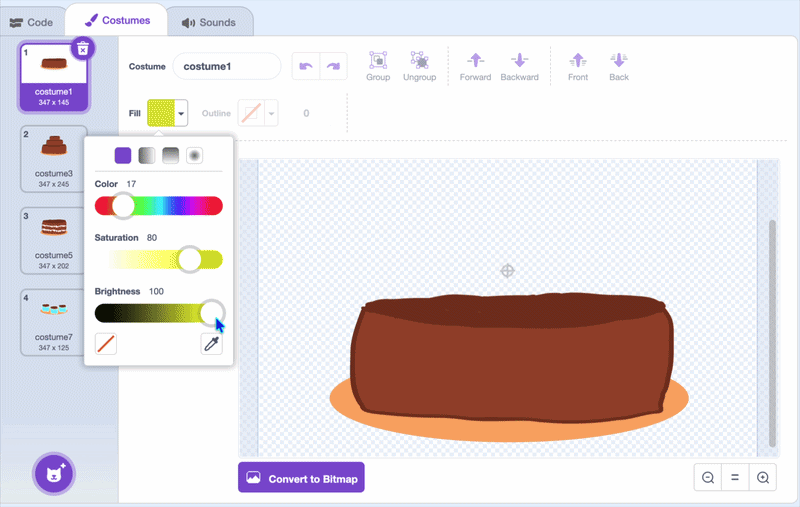
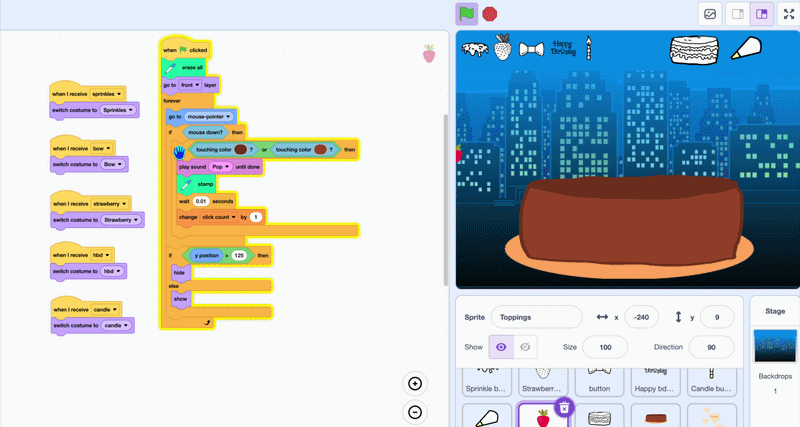

## Challenge: mix up the icing

--- challenge ---

For a second challenge, switch between different **icing flavours** — like chocolate, mint, and lemon.

--- /challenge ---

--- task ---

Make an icing button by **duplicating** one of your buttons and give it its own costume. Then move it to the top of the stage.



--- /task ---

--- task ---

Click on the **code tab**. Change the `go to x: () y: ()`{:class="block3motion"} to the right position, and change the `broadcast ()`{:class="block3events"} to `icing`.

--- /task ---

--- task ---

Create two variables, `icing flavour`{:class="block3variables"} and `counter`{:class="block3variables"}. Set them up on the button's green flag.

```blocks3
when green flag clicked
go to x: (166) y: (152)
+set [counter v] to (0)
+set [icing flavour v] to [choc]
```

--- /task ---

--- task ---

The `counter`{:class="block3variables"} changes the `icing flavour`{:class="block3variables"} each time.

```blocks3
when I receive (icing v)
change [counter v] by (1)
if <(counter) = (3)> then
set [counter v] to (0)
end
if <(counter) = (0)> then
set [icing flavour v] to [choc]
end
if <(counter) = (1)> then
set [icing flavour v] to [mint]
end
if <(counter) = (2)> then
set [icing flavour v] to [lemon]
end
```

--- /task ---

--- task ---



Click on the **choc cake**, and in the **code tab** add these blocks so it re-stamps when the icing flavour is chocolate.

```blocks3
when I receive (icing v)
switch costume to (cake type)
if <(icing flavour) = [choc]> then
erase all
go to x: (0) y: (0)
stamp
end
```

--- /task ---

--- task ---

Put your blocks for cake type into an if block. so the cake type also changes.

```blocks3
when I receive (type v)
switch costume to (cake type)
+if <(icing flavour) = [choc]> then
erase all
next costume
go to x: (0) y: (0)
stamp
set [cake type v] to (costume [number v])
end
```

--- /task ---

--- task ---

Now **duplicate** the **choc cake** sprite for each new flavour and rename the copies, like **mint cake** and **lemon cake**. The blocks come with them.



--- /task ---

--- task ---

In the **Costumes tab**, use the fill tool to recolour the cake for its new flavour — for example, make a lemon cake yellow.



**Tip:** Fill every costume of the cake with the same colour, so your toppings still stamp on all of them.

Then in the **code tab**, change `choc` to that cake's own flavour, like `mint` or `lemon`, in both sets of blocks.

--- /task ---

--- task ---

Select the **toppings** sprite.


Finally, duplicate the `touching color`{:class="block3sensing"} check and add the new lemon colour, so toppings stamp on the new cakes too. 



--- /task ---

**Test:** Click the green flag and switch the icing flavour.

--- save ---
