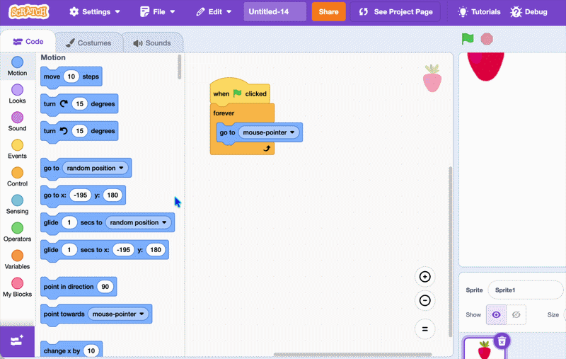

## Make a topping

In this step, you'll make your first **topping**. 

--- task ---

Start a [new Scratch project](https://scratch.mit.edu/projects/editor/){:target="_blank"}.

--- /task ---

--- task ---

In the **costume tab**, delete the cat and create your topping. You can use the paint tool or choose from the sprite library.

A topping can be anything you like — sprinkles, a strawberry, a bow, or a candle. 

--- /task ---

--- task ---

Name the sprite **toppings**, because later it will have lots of different toppings.


--- /task ---

--- task ---

Make the sprite follow the cursor using a `go to (mouse pointer)`{:class="block3motion"} block.

```blocks3
when green flag clicked
forever
go to (mouse-pointer v)
end
```

--- /task ---

--- task ---

Now make it draw a topping when you click.

Find the `stamp` block by clicking the **Add Extension** in the bottom-left corner, then choose **Pen**.



--- /task ---

--- task ---

Add an `if then`{:class="block3control"} block inside the `forever`{:class="block3control"} loop that checks `mouse down?`{:class="block3sensing"} and then it `stamp`s.

```blocks3
when green flag clicked
forever
go to (mouse-pointer v)
+if <mouse down?> then
stamp
end
end
```

--- /task ---

--- task ---

Add an `erase all` block to clear the screen.

```blocks3
when green flag clicked
+erase all
forever
go to (mouse-pointer v)
if <mouse down?> then
stamp
end
end
```

--- /task ---

--- task ---

Choose a sound for each time you add a topping from the sound library.

First add a new sound in the **Sounds tab**. Then add a `play sound until done`{:class="block3sound"} block and select your sound from the drop-down menu.

```blocks3
when green flag clicked
erase all
forever
go to (mouse-pointer v)
if <mouse down?> then
+play sound (Pop v) until done
stamp
end
end
```

--- /task ---

**Test:** Click the green flag, then click around the stage to see stamps of your topping.
