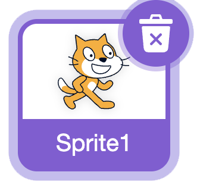
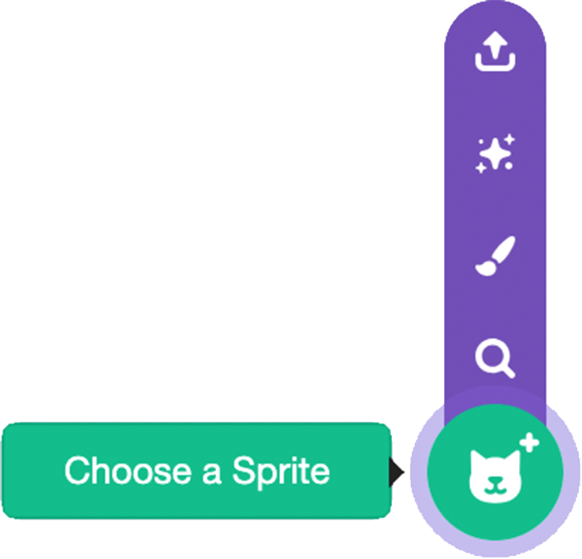
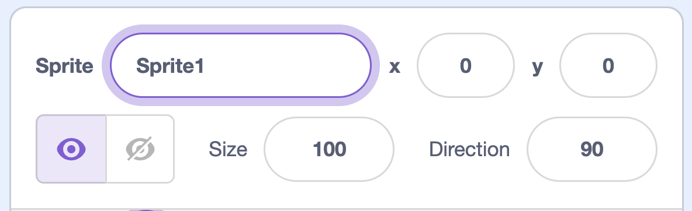
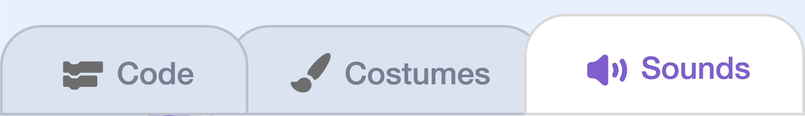

## Make a topping

In this step, you'll make your first **topping**. 

> [!TASK]
>
> Start a [new Scratch project](https://scratch.mit.edu/projects/editor/){:target="_blank"}.

> [!TASK]
>
> Delete the cat sprite using the trashcan symbol.
>
> {:width="200px"}

> [!TASK]
>
> Add a new sprite for your topping. Hover over **Choose a Sprite** and pick **Paint** to draw your own, or choose one from the library.
>
> {:width="250px"}
>
> A topping can be anything you like — sprinkles, a strawberry, a bow, or a candle. 

> [!TASK]
>
> Name the sprite **toppings**, because later it will have lots of different toppings. 
>
> In the box, delete "Sprite1" and type "Toppings".
>
> {:width="450px"}

> [!TASK]
>
> Make the sprite follow the cursor using a `go to`{:class="block3motion"} block.
>
> ```blocks3
> when green flag clicked
> forever
> go to (mouse-pointer v)
> end
> ```

> [!TASK]
>
> Now make it draw a topping when you click.
>
> Find the `stamp`{:class="block3extensions"} block by clicking the **Add Extension** in the bottom-left corner, then choose **Pen**.
>
> {:width="450px"}

> [!TASK]
>
> Add an `if then`{:class="block3control"} block inside the loop that checks `mouse down?`{:class="block3sensing"} and then it **stamps**.
>
> ```blocks3
> when green flag clicked
> forever
> go to (mouse-pointer v)
> +if <mouse down?> then
> stamp
> end
> end
> ```

**Test:** Click the green flag and click around the stage. Your topping should stamp wherever you click.

> [!TASK]
>
> Choose a sound for each time you add a topping from the sound library.
>
> First, add a new sound in the **Sounds tab**. 
>
> {:width="450px"}

> [!TASK]
>
> Then add a `play sound until done`{:class="block3sound"} block and select your sound from the drop-down menu.
> ```blocks3
> when green flag clicked
> forever
> go to (mouse-pointer v)
> if <mouse down?> then
> +play sound (Pop v) until done
> stamp
> end
> end
> ```

**Test:** Click the green flag, then click around the stage to see stamps of your topping. Test that they erase when you click the green flag again.
