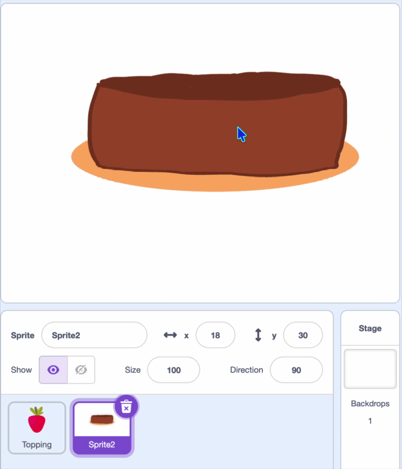

## Make a cake

In this step, you'll add your **cake** sprite.

{:width="150px"}

> [!TASK]
>
> Add a new sprite using the paint tools to draw your cake. Or you can add the cake sprite from the sprite library, and delete the candles.  
>
> {:width="250px"}

> [!TASK]
>
> The topping will use the cake colour in a later step, so use the fill tool to recolour the cake using one main colour.
>
> {:width="250px"}

> [!TASK]
>
> Position the cake at the bottom of the stage.
>
> {:width="450px"}

> [!TASK]
>
> Add a `go to x: y:`{:class="block3motion"} block and change the x and y to your position.
>
> ```blocks3
> when green flag clicked
> go to x: (0) y: (-100)
> ```

> [!TASK]
>
> Add a `hide`{:class="block3looks"} block to hide the sprite, then `stamp`{:class="block3extensions"} to draw the cake.
>
> The `erase all`{:class="block3extensions"} block clears all the stamps, so you can start again by clicking the `green flag`{:class="block3events"}.
>
> ```blocks3
> when green flag clicked
> +hide
> +erase all
> go to x: (0) y: (-100)
> +stamp
> ```

**Test:** Click the green flag and see that the cake appears on the stage.

