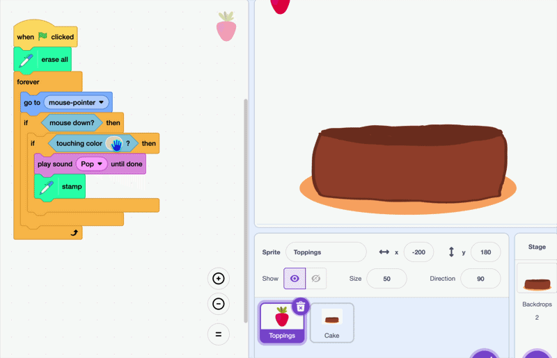

## Decorate the cake

Right now your topping stamps anywhere you click. In this step, you'll make it stamp **only on the cake**.

--- task ---

Select the **toppings** sprite.


--- /task ---

--- task ---

In the **Code** tab, add an `if then`{:class="block3control"} block inside the `mouse down`{:class="block3sensing"} check, and move the `stamp` block inside it.

Click the colour box in the `touching color`{:class="block3sensing"} block, then use the **eyedropper** to pick the main colour from your cake.



```blocks3
when green flag clicked
erase all
forever
go to (mouse-pointer v)
if <mouse down?> then
+if <touching color [#7d3a1f]?> then
play sound (Pop v) until done
stamp
end
end
```

--- /task ---

**Test:** Click the green flag and try stamping. Your topping only stamps when the mouse is over the cake.

**Tip:** If your cake has more than one colour, you can check for both by joining two `touching color`{:class="block3sensing"} blocks with an `or`{:class="block3operators"} block.


