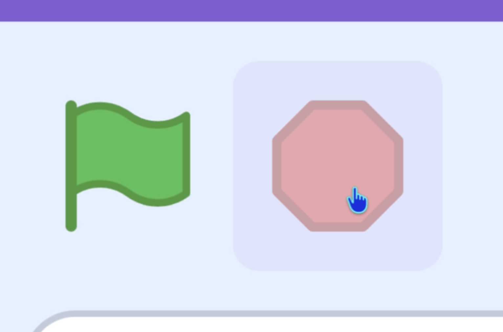

## Decorate the cake

Right now your topping stamps anywhere you click. In this step, you'll make it stamp **only on the cake**.

> [!TASK]
>
> Select the **toppings** sprite.
>
> {:width="150px"}

> [!TASK]
>
> In the **Code tab**, move the `play sound until done`{:class="block3sound"} and `stamp`{:class="block3extensions"} blocks into an `if then`{:class="block3control"} block.
>
> ```blocks3
> when green flag clicked
> forever
> go to (mouse-pointer v)
> if <mouse down?> then
> +if <> then
> play sound (Pop v) until done
> stamp
> end
> end
> end
> ```

> [!TASK]
>
> Add a `touching color`{:class="block3sensing"} block into the empty `if then`{:class="block3control"}.
>
> ```blocks3
> when green flag clicked
> forever
> go to (mouse-pointer v)
> if <mouse down?> then
> +if <touching color [#7d3a1f]?> then
> play sound (Pop v) until done
> stamp
> end
> end
> end
> ```

> [!TASK]
>
> **Stop your project** by clicking the red hexegan.
>
> {:width="450px"}
>
> Now use the eyedropper to pick the colour from your cake.
>
> {:width="450px"}

> [!TIP]
>
> If your cake has more than one colour, you can use an `or`{:class="block3operators"} block to pick two colours.

**Test:** Click the green flag and see that your topping stamps when the cursor is over the cake, but not anywhere else.

