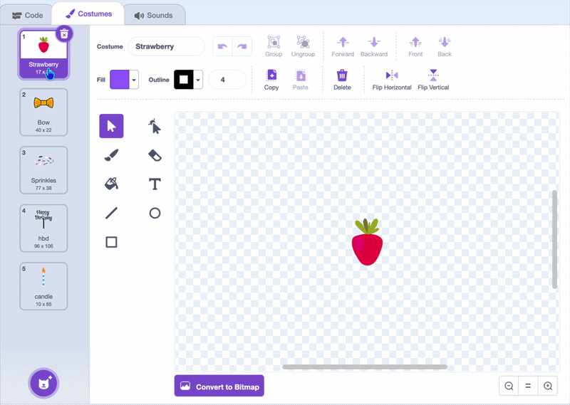

## More toppings

Make more toppings for your cake — like a bow, a strawberry, or a candle.

--- task ---

In the **costume tab**, add a new costume for each topping and give the new costumes a name so you can find it later.

Your **toppings** sprite now has more than one costume to stamp.

--- /task ---