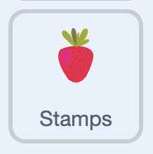

## Switch between toppings

In this step, you'll make your **toppings** switch costume so clicking a chooser changes which topping you stamp.

--- task ---



In the **toppings** sprite add a `when I receive ()`{:class="block3events"} script that `switch costume to ()`{:class="block3looks"} the matching costume.

```blocks3
when I receive (bow v)
switch costume to (bow v)
```

--- /task ---

--- task ---

Add one of these scripts for every topping you made, matching each message to its costume.

```blocks3
when I receive (strawberry v)
switch costume to (strawberry v)
```

--- /task ---

**Test:** Click a chooser to pick a topping, then click on the cake to stamp it. You now have a working cake decorator!


