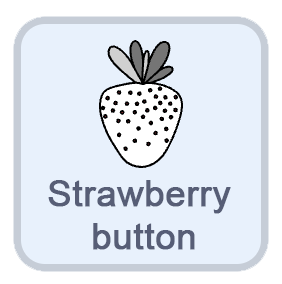
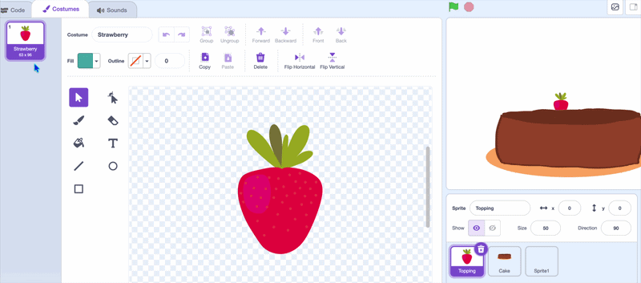
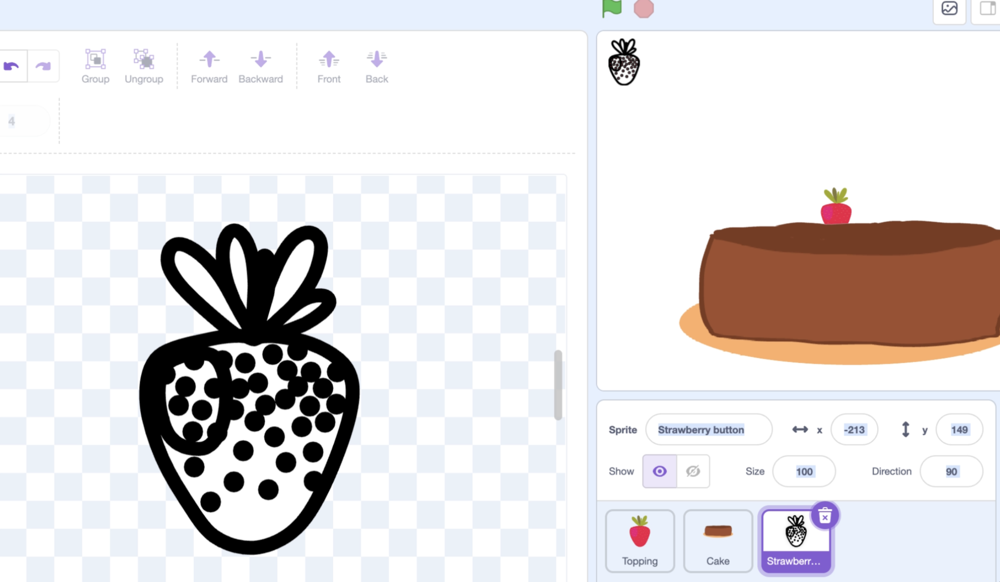
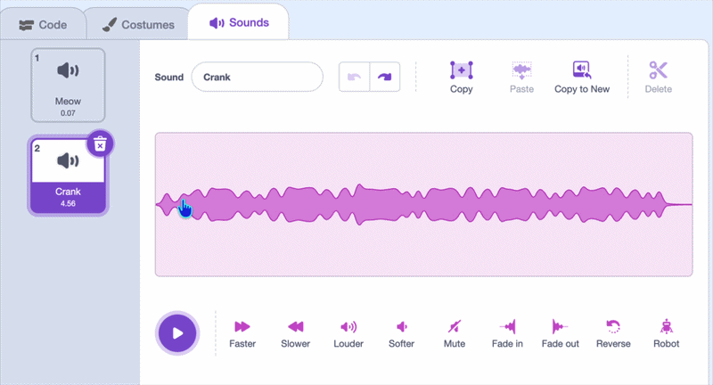
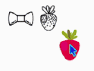

## Add a button

In this step, you'll make a button for one of the toppings.

> [!TASK]
>
> {:width="150px"}
>
> Create a new sprite. 

> [!TASK]
>
> In the **costume tab**, make an icon for your button. You can paint it, or copy across your topping costume and edit that. 
>
>
> {:width="450px"}

> [!TASK]
>
> Resize and position the button near the top of the stage.
>
> In the **code tab**, add a `go to x: y:`{:class="block3motion"} block so the button starts in the same place each time. Your numbers should match wherever you placed the button.
>
> ```blocks3
> when green flag clicked
> go to x: (-135) y: (154)
> ```
>
> {:width="450px"}

> [!TASK]
>
> Add a `broadcast`{:class="block3events"} message onto a `when this sprite clicked`{:class="block3events"} block and name the new message to match your sprite.
>
> ```blocks3
> when this sprite clicked
> broadcast (strawberry v)
> ```

> [!TASK]
>
> Make the button feel like it is being clicked by moving it and adding sound.
>
> Add the `change y by`{:class="block3motion"} and `play sound until done`{:class="block3sound"} blocks.
>
> ```blocks3
> when this sprite clicked
> broadcast (strawberry v)
> +change y by (1)
> +play sound (Crank v) until done
> +change y by (-1)
> ```

> [!TASK]
>
> If your sound is too long, you can cut it using the sound editing tools.
>
> {:width="450px"}

**Test:** Your buttons do not work yet because the topping is in the way. Make it **hide** when it's near the top.

{:width="450px"}

> [!TASK]
>
> Select the **toppings** sprite.
>
> {:width="150px"}
>
> Add an `if then else`{:class="block3control"} block so that if the `y position`{:class="block3motion"} is above `125` it hides. Otherwise, it shows. 
>
> ```blocks3
> when green flag clicked
> forever
> go to (mouse-pointer v)
> if <mouse down?> then
> if <touching color [#7d3a1f]?> then
> play sound (Pop v) until done
> stamp
> end
> end
> +if <(y position) > (125)> then
> hide
> else
> show
> end
> end
> ```

**Test:** Click the green flag and check that the topping hides, and you can click the button.
