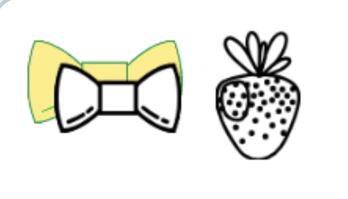

## Add a button

In this step, you'll make a button for each cake topping and place it at the top of the stage.

--- task ---

Create a new sprite for the button. Paint it, or bring in a copy of your topping costume.


--- /task ---

--- task ---

Click on the **code tab**. Resize and position the button near the top of the stage.

```blocks3
when green flag clicked
go to x: (-135) y: (154)
```

--- /task ---

--- task ---

Add a `broadcast`{:class="block3events"} message onto a `when this sprite clicked`{:class="block3events"} block and name the new message to match your sprite.

```blocks3
when this sprite clicked
broadcast (bow v)
```

--- /task ---

--- task ---

Make the button feel like it is being clicked by moving it and adding sound.

Add the `change y by ()`{:class="block3motion"} and `play sound () until done`{:class="block3sound"} blocks.

```blocks3
when this sprite clicked
broadcast (bow v)
+change y by (1)
+play sound (Crank v) until done
+change y by (-1)
```

You can cut sounds using the sound editing tools.


--- /task ---

--- task ---

To make a button for your other toppings, **duplicate** this sprite, and change its costume to the matching topping.

Move it to a different spot along the top and change the `broadcast ()`{:class="block3events"} message to match.

--- /task ---

--- task ---

Your topping follows the cursor all over the stage, even up to the top. Make it **hide** when it's near the top, so it only shows over the cake.



Select the **toppings** sprite.


Add an `if then else`{:class="block3control"} block so that if the `y position`{:class="block3motion"} is above `125` it hides. Otherwise, it shows.

```blocks3
when green flag clicked
erase all
forever
go to (mouse-pointer v)
if <mouse down?> then
if <touching color [#7d3a1f]?> then
play sound (Pop v) until done
stamp
end
end
+if <(y position) > (125)> then
hide
else
show
end
end
```

--- /task ---

**Test:** Click the green flag. The topping hides, and you can click the buttons.
