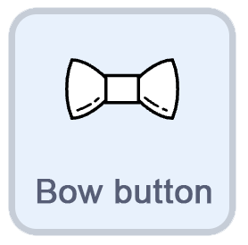
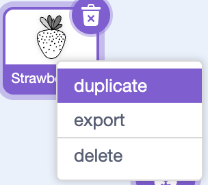
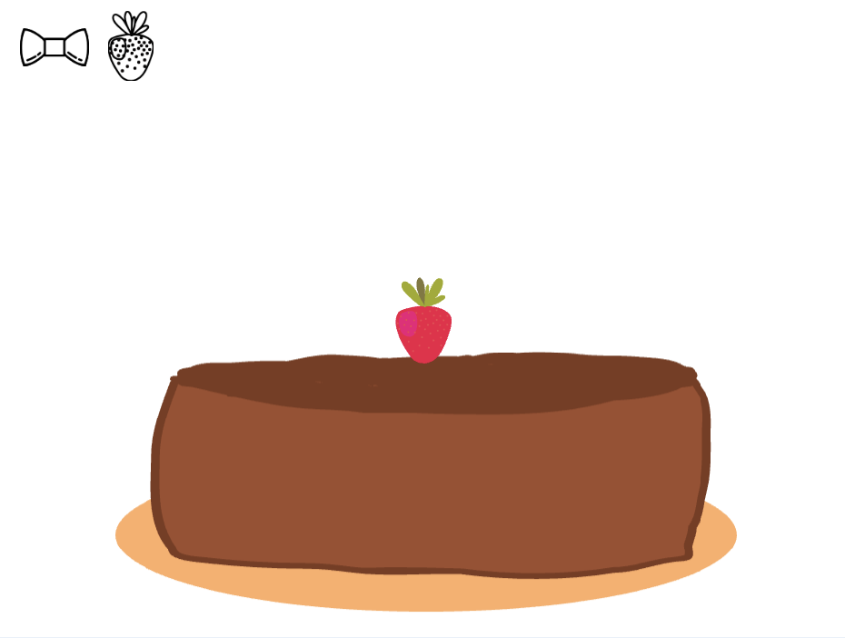
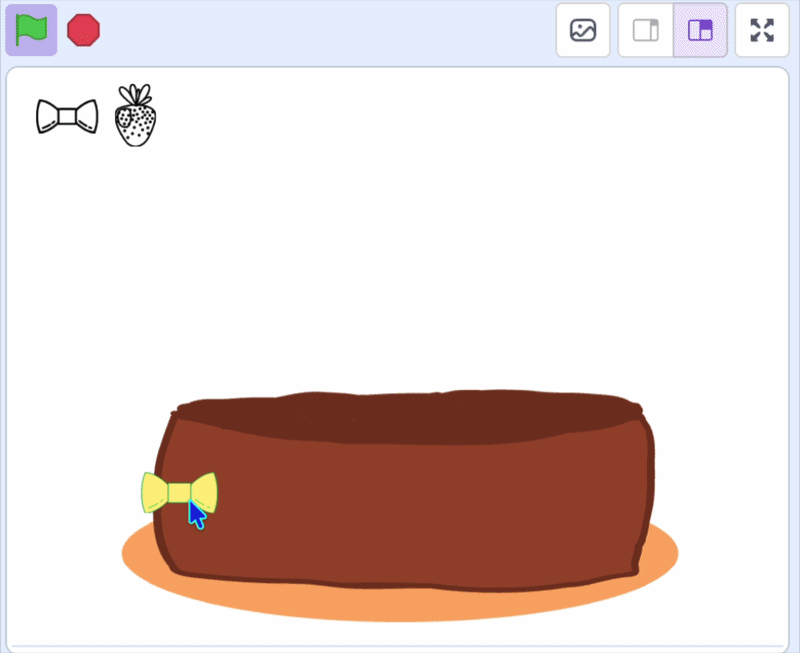

## Switch between toppings

In this step, you'll make your **toppings** switch costume so clicking a button changes which topping you stamp.

--- task ---


In the **toppings** sprite add a `when I receive`{:class="block3events"} block that `switch costume to`{:class="block3looks"} the matching costume.

```blocks3
when I receive (strawberry v)
switch costume to (strawberry v)
```
--- /task ---

--- task ---



Now make a button for each of your other toppings. **Duplicate** your button sprite, and make an icon by changing its costume.



--- /task ---

--- task ---

Move each button to a different position along the top, and change its `broadcast`{:class="block3events"} message to match the topping name. 



--- /task ---

--- task ---


Back on the **toppings** sprite, duplicate the `when I receive`{:class="block3events"} block for each of your new buttons, and match every message to its costume.

```blocks3
when I receive (bow v)
switch costume to (bow v)
```

--- /task ---

**Test:** Click the green flag and pick a topping, then click on the cake to stamp it. You now have a working cake decorator!




