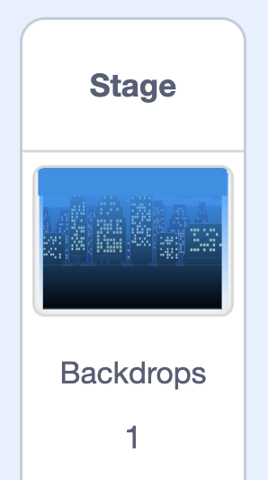

## Add music and a backdrop

Add a **backdrop** behind your cake and some **music** that plays while the player decorates.

--- task ---

Click the **Stage** in the bottom-right, then **Choose a Backdrop** and pick one you like — or click **Paint** to make your own.



**Tip:** Make sure your backdrop is a different colour to your cake, so it doesn't interfere with the `touching color`{:class="block3sensing"} block.

--- /task ---

--- task ---

Click the **Sounds** tab and add a piece of loop music you like from the sound library, or upload your own.

--- /task ---

--- task ---

Go to the **Code** tab and add this script to the Stage so the music plays on a loop.

```blocks3
when green flag clicked
forever
play sound (background music v) until done
end
```

--- /task ---

**Test:** Click the green flag. Your cake now has a backdrop and music playing while you decorate.

