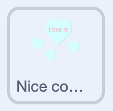
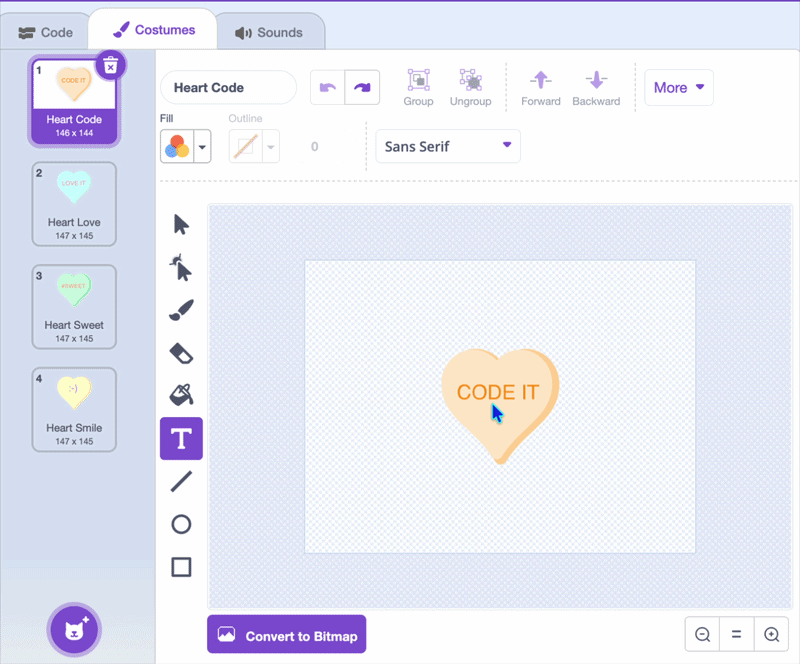

## Nice comments

In this step, you'll add pop-up comments that cheer the player on.

--- task ---

Add a new sprite for your comments.



Make a costume for each message — you can type words like "So sweet!" or "Yum!", or use pictures.



--- /task ---

--- task ---

Position the comment where you want it, and `hide`{:class="block3looks"}.

```blocks3
when green flag clicked
hide
```

--- /task ---

--- task ---

In the `Variable`{:class="block3variables"} menu, create a variable and name it `click count`{:class="block3variables"}.

```blocks3
when green flag clicked
hide
+set [click count v] to (0)
```

--- /task ---

--- task ---

Add a `forever`{:class="block3control"} loop. If `click count`{:class="block3variables"} is more than a random number, it shows the comment for a couple of seconds, then hides it and resets the count.

```blocks3
when green flag clicked
set [click count v] to (0)
hide
+forever
if <(click count) > (pick random (15) to (40))> then
show
wait (2) seconds
set [click count v] to (0)
hide
end
end
```

--- /task ---

--- task ---

Add a `switch costume to ()`{:class="block3looks"} block so a random comment shows. Change the `4` in `pick random (1) to (4)`{:class="block3operators"} to match how many comment costumes you have made.

```blocks3
when green flag clicked
set [click count v] to (0)
hide
forever
if <(click count) > (pick random (20) to (50))> then
+switch costume to (pick random (1) to (4))
show
wait (2) seconds
set [click count v] to (0)
hide
end
end
```

--- /task ---


--- task ---

Add a `start sound ()`{:class="block3sound"} block, and choose a sound from the sound library.

```blocks3
when green flag clicked
set [click count v] to (0)
hide
forever
if <(click count) > (pick random (20) to (50))> then
switch costume to (pick random (1) to (4))
show
+start sound (Wand v)
wait (2) seconds
set [click count v] to (0)
hide
end
end
```

--- /task ---

--- task ---

Select the **toppings** sprite.


Add a `change () by ()`{:class="block3variables"} block so `click count`{:class="block3variables"} goes up by `1` each time a topping is stamped.

```blocks3
if <touching color [#7d3a1f]?> then
play sound (Pop v) until done
stamp
+change [click count v] by (1)
end
```

--- /task ---

**Test:** Click the green flag and decorate, and see nice comments pop up to cheer you on.
