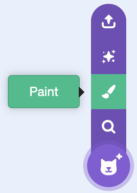

## Nice comments

In this step, you'll add pop-up comments that cheer the player on.

{:width="150px"}

> [!TASK]
>
> Add a new sprite for your comments.
>
> {:width="250px"}

> [!TASK]
>
> Make a costume for each message — you can type words like "So sweet!" or "Yum!", or use pictures. Position the comment where you want it to pop up.
>
> {:width="450px"}

> [!TASK]
>
> Add a `hide`{:class="block3looks"} block.
>
> ```blocks3
> when green flag clicked
> hide
> ```

> [!TASK]
>
> In the `Variables`{:class="block3variables"} menu, create a new variable and name it `click counter`{:class="block3variables"}.
>
> ```blocks3
> when green flag clicked
> hide
> +set [click counter v] to (0)
> ```

> [!TASK]
>
> Add a `forever`{:class="block3control"} loop that keeps checking the counter. When `click counter`{:class="block3variables"} goes above `19`, the comment shows its next costume, waits a couple of seconds, then hides and resets the counter.
>
> ```blocks3
> when green flag clicked
> set [click counter v] to (0)
> hide
> +forever
> if <(click counter) > (19)> then
> next costume
> show
> wait (2) seconds
> set [click counter v] to (0)
> hide
> end
> end
> ```

> [!TASK]
>
> Add a `start sound ()`{:class="block3sound"} block, and choose a fun sound from the sound library for when the comment pops up.
>
> ```blocks3
> when green flag clicked
> set [click counter v] to (0)
> hide
> forever
> if <(click counter) > (19)> then
> next costume
> show
> +start sound (Wand v)
> wait (2) seconds
> set [click counter v] to (0)
> hide
> end
> end
> ```

> [!TASK]
>
> Select the **toppings** sprite.
>
> {:width="150px"}

> [!TASK]
>
> Add a `change () by ()`{:class="block3variables"} block so `click counter`{:class="block3variables"} goes up by `1` each time a topping is stamped.
>
> ```blocks3
> if <touching color [#7d3a1f]?> then
> play sound (Pop v) until done
> stamp
> +change [click counter v] by (1)
> end
> ```

**Test:** Click the green flag and decorate, and see nice comments pop up to cheer you on.
