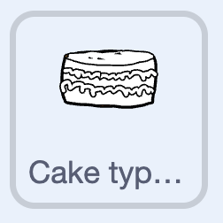
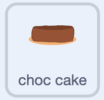
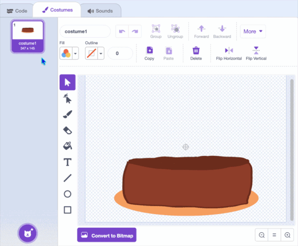

## Challenge: more cakes
--- challenge ---

For a challenge, you can let players switch between different **cake types** — layered, wedding or cupcakes. 

--- /challenge ---

--- task ---

**Duplicate** one of your chooser button sprites and change its costume to make a small cake symbol.



--- /task ---

--- task ---

Move the button to a free spot along the top of the stage.

```blocks3
when green flag clicked
go to x: (91) y: (149)
```

--- /task ---

--- task ---

When it's clicked, broadcast a new `layer` message with the usual press animation.

```blocks3
when this sprite clicked
broadcast (layer v)
change y by (1)
play sound (Crank v) until done
change y by (-1)
```

--- /task ---

--- task ---

Select the **cake** sprite.



Now give the cake more costumes to switch between. In the **Costumes** tab, **duplicate** your cake costume and change it into different cakes. Keep the main colour the same so your toppings still stamp on them.



--- /task ---

--- task ---

Create a variable called `layer type`{:class="block3variables"} and **untick** it to hide it. It remembers which cake is showing.

--- /task ---

--- task ---

On the **cake** sprite, set `layer type`{:class="block3variables"} to `1` at the start of its green-flag script.

```blocks3
when green flag clicked
+set [layer type v] to (1)
hide
go to x: (0) y: (0)
stamp
```

--- /task ---

--- task ---

Add a script so that when the cake receives the `layer` message, it switches to the next cake and stamps it.

```blocks3
when I receive (layer v)
switch costume to (layer type)
next costume
erase all
go to x: (0) y: (0)
stamp
set [layer type v] to (costume [number v])
```

--- /task ---

**Test:** Click the green flag, then click your cake-type button. The cake changes to the next one each time.

--- save ---
